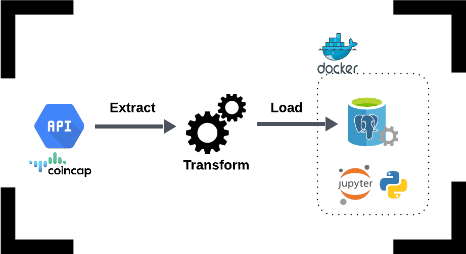

# ETL Pipeline from Crypto API to PowerBI, with Dockerized Postgres, Jupyter Notebook, and Python 



## Table of Contents

- [Project Structure](#project-structure)
- [Setup Instructions](#setup-instructions)
  - [Prerequisites](#prerequisites)
  - [Environment Variables](#environment-variables)
  - [Build and Run](#build-and-run)
- [Services](#services)
- [Project Definition](#project-definition)
  - [Data Source](#data-source)
  - [The ETL Jupyter Notebook](#etl-pipeline-notebook)
  - [The ETL Process](#etl-process)
  

## Project Structure

- **name_of_your_project_repo (project-root)/**
    - **.devcontainer/**
      - devcontainer.json
    - **your_jup_notebooks/**
      - etl_pipeline.ipynb
    - **.env**
    - **.python-version**
    - **Dockerfile**
    - **docker-compose.yml**
    - **requirements.txt**
    - **README.md**

## Setup Instructions

### Prerequisites

Make sure you have the following installed on your local development environment:

- [Docker](https://www.docker.com/get-started)
- [Docker Compose](https://docs.docker.com/compose/install/)
- [VSCode](https://code.visualstudio.com/) with the [Remote - Containers extension](https://marketplace.visualstudio.com/items?itemName=ms-vscode-remote.remote-containers)

Make sure to inclue a .gitignore file with the following information:
- *.pyc
- .env

### Environment Variables

The .gitignore file, ignores the ´.env´ file for security reasons. However, since this is just for educational purposes, follow the step below to include it in your project. If you do not include it, the docker will not work.

Create a `.env` file in the project root with the following content:

- POSTGRES_USER=your_postgres_user
- POSTGRES_PASSWORD=your_postgres_password
- POSTGRES_DB=your_postgres_db
- POSTGRES_HOST=postgres

### Build and Run

1. **Clone the repository:**

   ```bash
   git clone https://github.com/caiocvelasco/my-first-docker-project.git
   cd my-first-docker-project

2. **Build and start the containers:**

    When you open VSCode, it will automatically ask if you want to reopen the repo folder in a container and it will build for you.

### Services

- **Postgres**: A PostgreSQL database instance.
- **Python**: A container running Python 3.9.13 with necessary dependencies.
- **Jupyter Notebook**: A Jupyter Notebook instance to build your ETL Pipeline and interact with the data. 

## Project Definition

### Data Source
  The data is from an external 3rd party API called [CoinCap API](https://docs.coincap.io/#89deffa0-ab03-4e0a-8d92-637a857d2c91). CoinCap is a useful tool for real-time pricing and market activity for over 1,000 cryptocurrencies.

### The ETL Jupyter Notebook
  The etl_pipeline notebook is located under the `project-root > your_jupyter_notebooks` folder. It contains 3 functions that perform the 3 parts of the ETL process.

### The ETL Process
  Data is **extracted** from an external API (_extract()_ function), then it is **transformed** (_transform()_ function), and finally **loaded** (_load()_ function), i.e., persisted in a PostgreSQL database.
  
  During the transformation process, the semi-structured data (JSON) was normalized into a python DataFrame to assume a tabular (structured) format. Then, the data follows some cleaning procedures, such as converting categorical columns into numerical ones, handling missing data, and rounding some columns to 2 decimal places. 
  
  Data Quality checks were also performed during the process, guaranteeing that the data was correctly persisted in the PostgreSQL database.